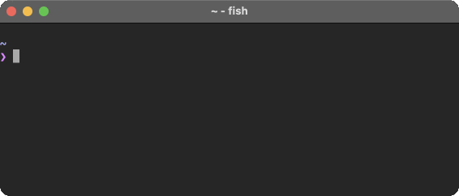

# Mocword

[](https://github.com/high-moctane/mocword/actions/workflows/release.yml)

Predict next words (｀･ω･´)



## Installation

**Important**: You must prepare Mocword dataset in advance. See below ([Dataset and Environment Variable](https://github.com/high-moctane/mocword#dataset-and-environment-variable)).

### Prebuilt Binary

Visit [Releases](https://github.com/high-moctane/mocword/releases).

### Cargo

```
cargo install mocword
```

## Dataset and Environment Variable

You need to get Mocword dataset from [high-moctane/mocword-data](https://github.com/high-moctane/mocword-data).

```
export MOCWORD_DATA=/path/to/mocword.sqlite
```

## Usage

### One Shot Mode

```
$ mocword -q "this is "
the
a
not
an
what
to
that
true
done
so
```

```
$ mocword -q "one of t" --limit 3
the
them
these
```

### Interactive Mode

```
$ mocword
this is
the a not an what to that true done so
one of t_
the them these those their two three this that themselves
```

The underscore is a white space.

## Query String

Ends with a white space -> predict successive words.

Ends without any white space -> predict words which begin with the last word's prefix.

## License

MIT
